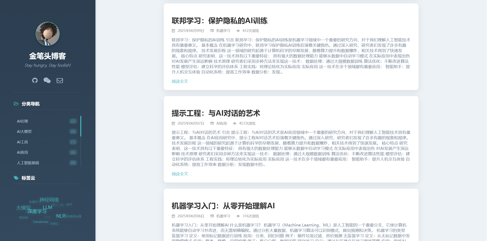
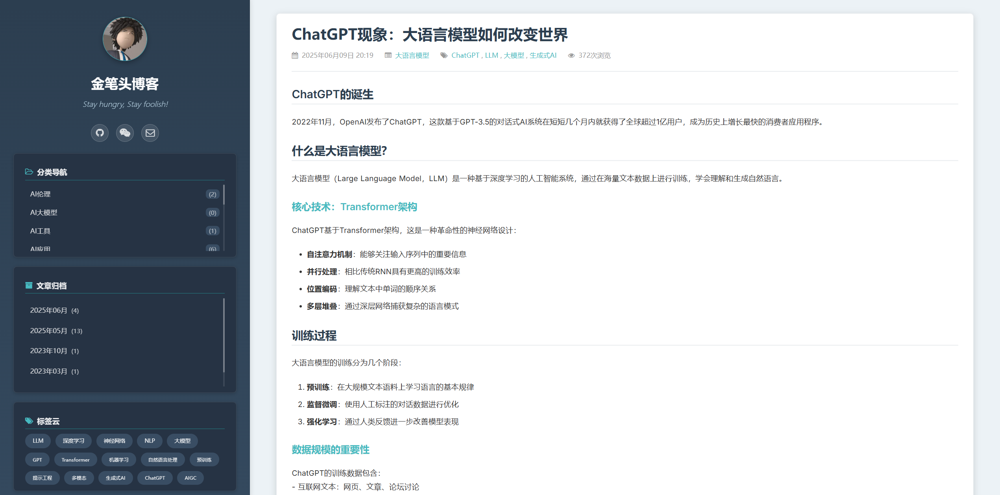
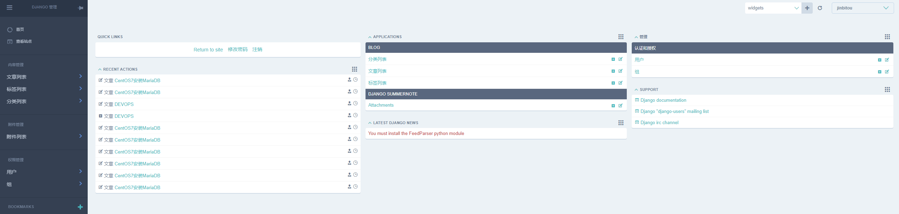
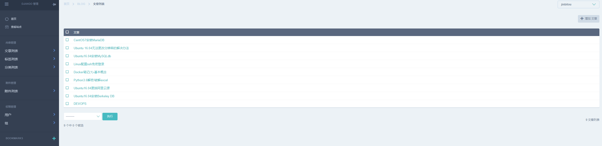

## 简介 Introduction

一个基于 **Django 5.2.2** 和 **Python 3.x** 的现代化博客系统，支持 Markdown 编辑和美观的管理界面。

A modern blog system based on **Django 5.2.2** and **Python 3.x**, featuring Markdown editing and beautiful admin interface.


## 技术栈 Tech Stack

| 技术 Technology | 版本 Version | 用途 Purpose |
|---|---|---|
| Django | 5.2.2+ | Web框架 / Web Framework |
| django-mdeditor | 0.1.20+ | Markdown编辑器 / Markdown Editor |
| django-admin-interface | 0.30.0+ | 管理界面美化 / Admin UI Enhancement |
| Pygments | 2.19.1+ | 代码高亮 / Code Highlighting |
| Markdown | 3.8+ | 内容渲染 / Content Rendering |
| PostgreSQL | 15+ | 数据库 / Database |

## 项目截图 Screenshots

### 前台页面 Frontend

*博客首页 - Blog Homepage*

---


*文章详情页 - Article Detail Page*


*移动端界面 - Mobile Page*

### 后台管理 Admin Backend

*后台文章管理 - Article Management*

---


*文章编辑页面 - Article Edit*

## 快速开始 Quick Start

### 环境要求 Requirements
- Python 3.8+
- Django 5.2.2+
- PostgreSQL (推荐) / MySQL / SQLite3

### 部署方式选择 Deployment Options

我们提供两种部署方式，您可以根据需求选择：

| 部署方式 | 适用场景 | 优势 |
|---|---|---|
| **🐳 Docker部署 (推荐)** | 生产环境、快速部署 | 环境隔离、一键部署、包含数据库 |
| **📦 传统部署** | 开发环境、自定义配置 | 灵活配置、便于调试 |

---

## 🐳 Docker部署 (推荐)

### 快速启动

1. **构建博客镜像**
   ```bash
   git clone https://github.com/leeyis/jbt_blog.git
   cd jbt_blog
   docker build -t blog:v1.0 .
   ```

2. **启动服务**
   ```bash
   docker-compose up -d
   ```

3. **创建管理员账号**
   ```bash
   docker-compose exec web python manage.py createsuperuser
   ```

4. **访问博客**
   - 前端访问：http://localhost
   - 后台管理：http://localhost/admin

### 服务说明

#### 服务组件
- **web**: 博客应用服务 (blog:v1.0)
- **db**: PostgreSQL数据库服务

#### 端口映射
- **80**: 博客前端访问端口
- **5432**: PostgreSQL数据库端口（仅内部网络）

#### 数据持久化
- PostgreSQL数据目录
- Django静态文件
- 用户上传文件

### 常用Docker命令

```bash
# 启动服务
docker-compose up -d

# 停止服务
docker-compose down

# 查看服务状态
docker-compose ps

# 查看日志
docker-compose logs web
docker-compose logs db

# 进入容器
docker-compose exec web sh
docker-compose exec db psql -U postgres -d blog

# 数据库迁移
docker-compose exec web python manage.py migrate

# 收集静态文件
docker-compose exec web python manage.py collectstatic --noinput
```

### 配置修改

#### 数据库配置
编辑 `docker-compose.yml` 中的环境变量：
```yaml
environment:
  POSTGRES_DB: your_db_name
  POSTGRES_USER: your_username
  POSTGRES_PASSWORD: your_password
```

#### 端口修改
修改 `docker-compose.yml` 中的端口映射：
```yaml
ports:
  - "8080:8000"  # 将80改为8080
```

### 故障排除

#### 常见问题

1. **端口冲突**
   - 检查80端口是否被其他服务占用
   - 修改端口映射到其他端口

2. **数据库连接失败**
   - 检查数据库服务是否正常启动
   - 确认环境变量配置正确

3. **权限问题**
   - 确保Docker有足够权限创建卷和网络
   - 检查文件权限设置

#### 日志调试
```bash
# 查看详细启动日志
docker-compose up --no-deps web

# 检查数据库健康状态
docker-compose exec db pg_isready -U postgres -d blog
```

### 生产环境建议

1. **安全配置**
   - 修改默认密码
   - 设置 `DEBUG=False`
   - 配置 `ALLOWED_HOSTS`

2. **性能优化**
   - 使用反向代理（Nginx）
   - 配置Redis缓存
   - 启用GZIP压缩

3. **备份策略**
   - 定期备份PostgreSQL数据
   - 备份用户上传的媒体文件
   - 使用外部存储卷

---

## 📦 传统部署

### 开发环境搭建 Dev Environment Setup

```bash
# 1. 克隆项目 Clone repository
git clone https://github.com/leeyis/jbt_blog.git
cd jbt_blog

# 2. 创建虚拟环境 Create virtual environment
conda create -n blog python=3.10 -y

# 激活虚拟环境 Activate virtual environment
conda activate blog
# 停用虚拟环境 Deactivate virtual environment (when needed)
# conda deactivate

# 3. 安装依赖 Install dependencies
pip install -r requirements.txt

# 4. 数据库迁移 Database migration
python manage.py makemigrations
python manage.py migrate

# 5. 创建超级用户 Create superuser
python manage.py createsuperuser

# 6. 启动服务器 Start server
python manage.py runserver
```

### 访问地址 Access URLs

- **前台首页 Frontend**: http://127.0.0.1:8000
- **后台管理 Admin**: http://127.0.0.1:8000/admin

## 功能特性 Features

### ✅ 已完成功能 Completed Features

#### 内容管理 Content Management
- [x] **文章管理** Article Management
  - 新增、编辑、删除文章 Add, edit, delete articles
  - Markdown 文本编辑器 Markdown editor
  - 代码高亮支持 Code highlighting support

- [x] **分类管理** Category Management  
  - 分类的增删改查 CRUD operations for categories
  - 分类层级支持 Hierarchical category support
  - 分类文章统计 Article count per category

- [x] **标签管理** Tag Management
  - 标签的增删改查 CRUD operations for tags  
  - 标签文章关联 Tag-article associations

#### 前台展示 Frontend Display
- [x] **文章展示** Article Display
  - 文章列表分页 Paginated article lists
  - 文章详情页面 Article detail pages
  - 阅读量统计 View count tracking
  - 上一篇/下一篇导航 Previous/Next article navigation

- [x] **搜索功能** Search Features
  - 按分类搜索 Search by category
  - 按标签搜索 Search by tags
  - 文章按月归档 Monthly article archives
- [x] **动态3D标签云** Dynamic 3D Tag Cloud
  - 首页交互式标签云展示，根据标签热度动态生成
  - 鼠标悬停高亮，点击可直接跳转到标签文章列表

#### 后台管理 Admin Management
- [x] **美化界面** Enhanced Interface
  - 现代化管理界面 Modern admin interface
  - 自定义主题颜色 Custom theme colors
  - 中文本地化 Chinese localization

- [x] **编辑体验** Editing Experience
  - 所见即所得编辑器 WYSIWYG editor
  - 实时预览功能 Live preview
  - **增强的图片上传** Enhanced Image Upload
    - 支持粘贴图片直接上传，简化工作流程

### 🚧 待开发功能 TODO Features

#### 高级搜索 Advanced Search
- [ ] **关键词搜索** Keyword Search
  - 全文搜索功能 Full-text search
  - 搜索结果高亮 Search result highlighting
  - 搜索历史记录 Search history

#### 社交功能 Social Features  
- [ ] **评论系统** Comment System
  - 文章评论功能 Article comments
  - 评论审核机制 Comment moderation
  - 评论回复功能 Comment replies
  - [ ] 评论邮件通知 Email notifications

#### 内容增强 Content Enhancement
- [ ] **文章推荐** Article Recommendation
  - 相关文章推荐 Related article suggestions
  - 热门文章排行 Popular articles ranking
  - 最新文章展示 Latest articles display

## 项目结构 Project Structure
```
jbt_blog/
├── apps/ # 应用目录 Apps directory
│ └── blog/ # 博客应用 Blog app
│ ├── models.py # 数据模型 Data models
│ ├── views.py # 视图函数 View functions
│ ├── admin.py # 管理配置 Admin configuration
│ └── templatetags/ # 模板标签 Template tags
├── jbt_blog/ # 项目配置 Project settings
│ ├── settings.py # 配置文件 Settings
│ └── urls.py # URL路由 URL routing
├── templates/ # 模板文件 Templates
├── static/ # 静态文件 Static files
├── media/ # 媒体文件 Media files
├── docker-compose.yml # Docker编排文件 Docker Compose
├── Dockerfile # Docker镜像构建 Docker Image Build
├── requirements.txt # 依赖列表 Dependencies
└── manage.py # 管理脚本 Management script
```

## 支持 Support

如遇到问题，请检查：
1. Docker和Docker Compose版本（Docker部署）
2. Python和依赖包版本（传统部署）
3. 系统资源使用情况
4. 网络连接状态
5. 服务日志输出

## 开源协议 License

本项目采用 MIT 协议.

This project is licensed under the MIT License.

**⭐ 如果这个项目对您有帮助，请给个星标支持！**
**⭐ If this project helps you, please give it a star!**