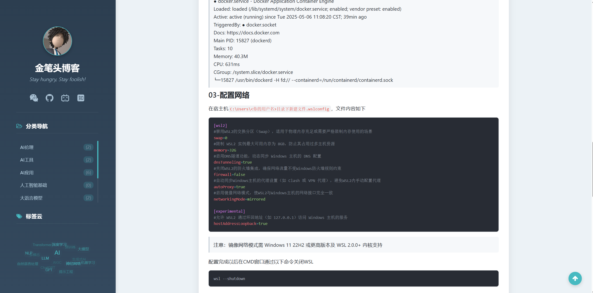
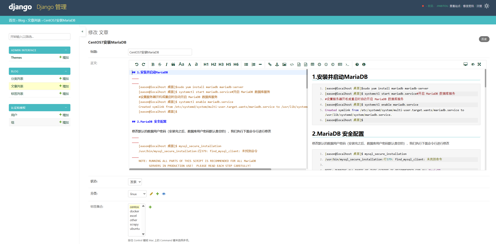

## 简介 Introduction

一个基于 **Django 5.2.2** 和 **Python 3.x** 的现代化博客系统，支持 Markdown 编辑和美观的管理界面。

A modern blog system based on **Django 5.2.2** and **Python 3.x**, featuring Markdown editing and beautiful admin interface.


## 技术栈 Tech Stack

| 技术 Technology | 版本 Version | 用途 Purpose |
|---|---|---|
| Django | 5.2.2+ | Web框架 / Web Framework |
| django-mdeditor | 0.1.20+ | Markdown编辑器 / Markdown Editor |
| django-admin-interface | 0.30.0+ | 管理界面美化 / Admin UI Enhancement |
| Pygments | 2.19.1+ | 代码高亮 / Code Highlighting |
| Markdown | 3.8+ | 内容渲染 / Content Rendering |

## 项目截图 Screenshots

### 前台页面 Frontend

*博客首页 - Blog Homepage*

---


*文章详情页 - Article Detail Page*

### 后台管理 Admin Backend

*后台文章管理 - Article Management*

---


*文章编辑页面 - Article Edit*


## 快速开始 Quick Start

### 环境要求 Requirements
- Python 3.8+
- Django 5.2.2+
- SQLite3 (默认) / MySQL / PostgreSQL

### 安装步骤 Installation

```bash
# 1. 克隆项目 Clone repository
git clone https://github.com/leeyis/jbt_blog.git
cd jbt_blog

# 2. 创建虚拟环境 Create virtual environment
conda create -n blog python=3.10 -y

# 激活虚拟环境 Activate virtual environment
conda activate blog
# 停用虚拟环境 Deactivate virtual environment (when needed)
# conda deactivate

# 3. 安装依赖 Install dependencies
pip install -r requirements.txt

# 4. 数据库迁移 Database migration
python manage.py makemigrations
python manage.py migrate

# 5. 创建超级用户 Create superuser
python manage.py createsuperuser

# 6. 启动服务器 Start server
python manage.py runserver
```

### 访问地址 Access URLs

- **前台首页 Frontend**: http://127.0.0.1:8000
- **后台管理 Admin**: http://127.0.0.1:8000/admin

## 功能特性 Features

### ✅ 已完成功能 Completed Features

#### 内容管理 Content Management
- [x] **文章管理** Article Management
  - 新增、编辑、删除文章 Add, edit, delete articles
  - Markdown 文本编辑器 Markdown editor
  - 代码高亮支持 Code highlighting support

- [x] **分类管理** Category Management  
  - 分类的增删改查 CRUD operations for categories
  - 分类层级支持 Hierarchical category support
  - 分类文章统计 Article count per category

- [x] **标签管理** Tag Management
  - 标签的增删改查 CRUD operations for tags  
  - 标签文章关联 Tag-article associations

#### 前台展示 Frontend Display
- [x] **文章展示** Article Display
  - 文章列表分页 Paginated article lists
  - 文章详情页面 Article detail pages
  - 阅读量统计 View count tracking
  - 上一篇/下一篇导航 Previous/Next article navigation

- [x] **搜索功能** Search Features
  - 按分类搜索 Search by category
  - 按标签搜索 Search by tags
  - 文章按月归档 Monthly article archives
- [x] **动态3D标签云** Dynamic 3D Tag Cloud
  - 首页交互式标签云展示，根据标签热度动态生成
  - 鼠标悬停高亮，点击可直接跳转到标签文章列表

#### 后台管理 Admin Management
- [x] **美化界面** Enhanced Interface
  - 现代化管理界面 Modern admin interface
  - 自定义主题颜色 Custom theme colors
  - 中文本地化 Chinese localization

- [x] **编辑体验** Editing Experience
  - 所见即所得编辑器 WYSIWYG editor
  - 实时预览功能 Live preview
  - **增强的图片上传** Enhanced Image Upload
    - 支持粘贴图片直接上传，简化工作流程

### 🚧 待开发功能 TODO Features

#### 高级搜索 Advanced Search
- [ ] **关键词搜索** Keyword Search
  - 全文搜索功能 Full-text search
  - 搜索结果高亮 Search result highlighting
  - 搜索历史记录 Search history

#### 社交功能 Social Features  
- [ ] **评论系统** Comment System
  - 文章评论功能 Article comments
  - 评论审核机制 Comment moderation
  - 评论回复功能 Comment replies
  - [ ] 评论邮件通知 Email notifications

#### 内容增强 Content Enhancement
- [ ] **文章推荐** Article Recommendation
  - 相关文章推荐 Related article suggestions
  - 热门文章排行 Popular articles ranking
  - 最新文章展示 Latest articles display

## 项目结构 Project Structure
```
jbt_blog/
├── apps/ # 应用目录 Apps directory
│ └── blog/ # 博客应用 Blog app
│ ├── models.py # 数据模型 Data models
│ ├── views.py # 视图函数 View functions
│ ├── admin.py # 管理配置 Admin configuration
│ └── templatetags/ # 模板标签 Template tags
├── jbt_blog/ # 项目配置 Project settings
│ ├── settings.py # 配置文件 Settings
│ └── urls.py # URL路由 URL routing
├── templates/ # 模板文件 Templates
├── static/ # 静态文件 Static files
├── media/ # 媒体文件 Media files
├── requirements.txt # 依赖列表 Dependencies
└── manage.py # 管理脚本 Management script
```

## 开源协议 License

本项目采用 MIT 协议.

This project is licensed under the MIT License.

**⭐ 如果这个项目对您有帮助，请给个星标支持！**
**⭐ If this project helps you, please give it a star!**